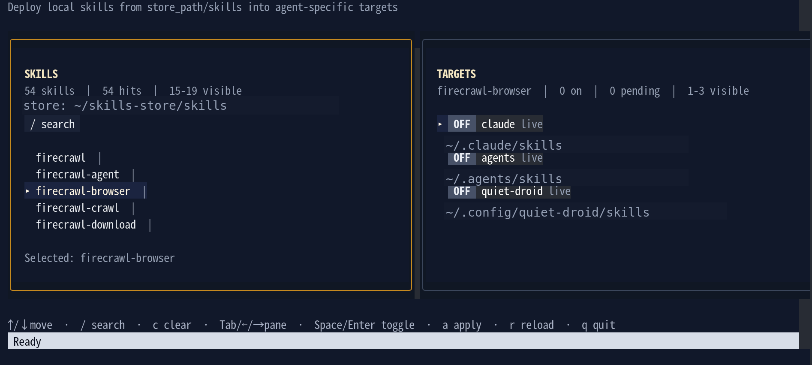

<h1 align="center">Local Skill Manager</h1>

<p align="center">シンボリックリンクでローカル Agent Skills を管理する TUI です。</p>

<p align="center">
  <a href="README_JP.md"></a>
  <a href="README.md"></a>
</p>

<p align="center">
  
  
  
  
</p>

<p align="center">
  
</p>

## ✨ 概要

Local Skill Manager は `store_path/skills` 配下の Skill を読み取り、各エージェント用の解決済み Skill ディレクトリに対して、シンボリックリンクの作成・削除で有効化と無効化を行います。

## 🚀 機能

- 2 ペインの TUI で Skill 一覧を閲覧
- 各 `SKILL.md` の `description:` を表示
- Skill 名と description で検索
- target ごとに Skill を切り替え
- ファイルコピーではなくシンボリックリンクで配備
- 1 つの設定ファイルで複数の agent root を管理

## 📋 前提条件

- Go `1.22+`
- 矢印キーと標準 ANSI 表示に対応したターミナル
- `skills/<skill-name>/SKILL.md` を持つローカル Skill ストア
- シンボリックリンクを作成できるファイルシステム

## 📁 ディレクトリ構成

```text
<store_path>/
  skills/
    skill-a/
      SKILL.md
    skill-b/
      SKILL.md
```

Skill を有効化すると、次のリンクを作成します。

```text
<resolved skill directory>/<skill-name> -> <store_path>/skills/<skill-name>
```

## ⚙️ 設定

プロジェクト直下に `config.json` を置きます。`--config` を省略した場合は `./config.json` を読みます。

```json
{
  "store_path": "~/.open_skills",
  "link_targets": [
    "~/.claude",
    "~/.agents",
    "~/.cursor",
    "~/.gemini",
    "~/.gemini/antigravity",
    "~/.copilot",
    "~/.config/opencode",
    "~/.codeium/windsurf"
  ]
}
```

### 各フィールド

- `store_path`
  ローカル Skill ストアのルートです。`store_path/skills` を走査します。
- `link_targets`
  agent root ディレクトリです。各 target から実際の Skill ディレクトリを解決します。

### 解決済み Skill ディレクトリ

- `~/.claude` -> `~/.claude/skills`
- `~/.agents` -> `~/.agents/skills`
- `~/.config/opencode` -> `~/.config/opencode/skills`
- `~/.cursor` -> `~/.cursor/skills-cursor` があればそれを使用し、無ければ `~/.cursor/skills`
- その他の target -> `<target>/skills`

## ▶️ 実行方法

まずバイナリをビルドします:

```bash
go build -buildvcs=false ./cmd/local-skill-manager
```

カレントディレクトリの `config.json` を使う場合:

```bash
./local-skill-manager
```

別の設定ファイルを使う場合:

```bash
./local-skill-manager --config ./config.example.json
```

`PATH` が通っていれば、次のようにも実行できます:

```bash
local-skill-manager
```

`go run` は開発時の確認用です:

```bash
go run ./cmd/local-skill-manager
```

## 📦 リリースビルド

対応プラットフォーム向けのバイナリをまとめて作る場合:

```bash
make build-cross
```

生成物は `dist/` に生バイナリと zip の両方で出力されます:

- `local-skill-manager_linux_amd64`
- `local-skill-manager_linux_arm64`
- `local-skill-manager_darwin_amd64`
- `local-skill-manager_darwin_arm64`
- `local-skill-manager_windows_amd64.exe`
- `local-skill-manager_windows_arm64.exe`
- `local-skill-manager_linux_amd64.zip`
- `local-skill-manager_linux_arm64.zip`
- `local-skill-manager_darwin_amd64.zip`
- `local-skill-manager_darwin_arm64.zip`
- `local-skill-manager_windows_amd64.zip`
- `local-skill-manager_windows_arm64.zip`

GitHub Releases 用の自動ビルドは `.github/workflows/release.yml` で定義してあり、`v0.1.0` のようなタグを push すると各 OS 向けの zip を同時に添付できます。

## 🎮 使い方

### 基本操作

1. アプリを起動する
2. 左ペインで Skill を選ぶ
3. 右ペインへ移動する
4. target ごとに ON/OFF を切り替える
5. 保留中の変更を適用する

### キーバインド

- `↑ / ↓`
  選択移動
- `Tab` / `←` / `→`
  ペイン切り替え
- `Enter`
  左ペインでは右ペインへ移動し、右ペインでは target を切り替え
- `Space`
  右ペインで target を切り替え
- `a`
  保留中の変更を適用
- `r`
  Skill 一覧を再読込
- `q`
  終了

### 検索

- `/`
  左ペインで検索開始
- 文字入力
  Skill 名と description でフィルタ
- `Enter`
  検索を確定
- `Esc`
  検索モードを終了
- `Ctrl+u`
  入力中の検索語をクリア
- `c`
  現在のフィルタをクリア

## 🔗 動作仕様

- `SKILL.md` を持つディレクトリだけを Skill として扱います
- `SKILL.md` frontmatter の `description:` を読める場合は表示します
- `ON` は解決済み Skill ディレクトリにシンボリックリンクが存在すべき状態です
- `OFF` はそのシンボリックリンクを削除すべき状態です

## 📝 注意点

- Source 側の Skill ファイルはコピーしません
- Source Skill を編集すると、リンクしている全 target に反映されます
- target を無効化しても Source Skill は削除されません
- 同名 Skill が target 側にある場合は置き換えます
- Windows ではシンボリックリンク作成に Developer Mode または管理者権限が必要な場合があります
- Windows では zip を展開して、その中の `local-skill-manager_windows_<arch>.exe` を実行します

## 🛠️ トラブルシュート

### Skill が表示されない

- `config.json` がカレントディレクトリにあるか、または `--config` が正しいファイルを指しているか確認する
- `store_path/skills` が存在するか確認する
- 各 Skill ディレクトリに `SKILL.md` があるか確認する

### Skill を有効化できない

- target ディレクトリに書き込み権限があるか確認する
- ファイルシステムがシンボリックリンクを許可しているか確認する
- 配置先に保護された既存ファイルやディレクトリが無いか確認する
- Windows では Developer Mode を有効にするか、管理者権限のターミナルで実行する

### 検索で何も出ない

- Skill 名または description に一致しているか確認する
- `c` でフィルタを解除する

## 🧪 開発

整形:

```bash
gofmt -w ./cmd ./internal
```

テスト:

```bash
GOCACHE=$PWD/.cache/go-build GOMODCACHE=$PWD/.cache/go-mod go test ./...
```

ビルド:

```bash
GOCACHE=$PWD/.cache/go-build GOMODCACHE=$PWD/.cache/go-mod go build -buildvcs=false ./cmd/local-skill-manager
```

全対応バイナリのクロスビルド:

```bash
make build-cross
```
